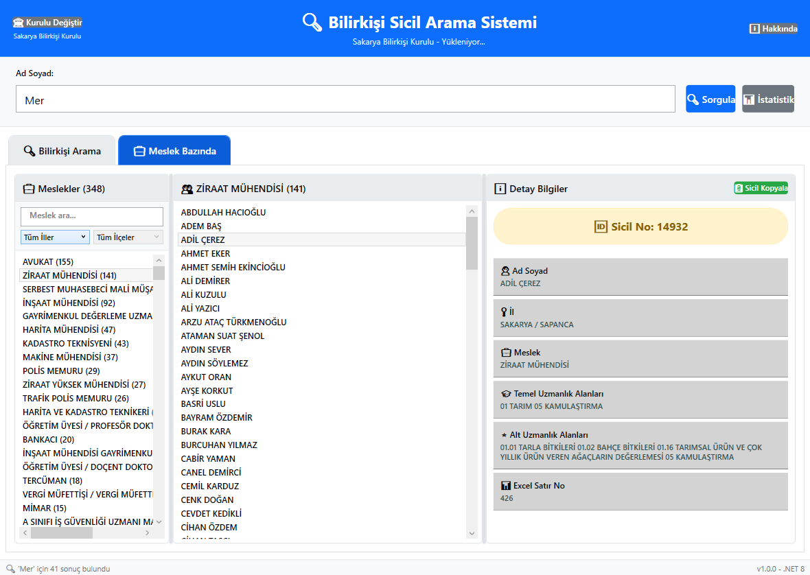

# BilirkisiAramaSistemi: Modern Bilirkişi Arama Platformu

  

BilirkisiAramaSistemi, adli ve hukuki süreçlerinizde en doğru bilirkişiyi saniyeler içinde bulmanızı sağlayan modern bir masaüstü uygulamasıdır. Gelişmiş arama ve filtreleme yetenekleriyle, Türkiye'nin dört bir yanındaki binlerce uzman profiline anında erişim sunarak adaletin hızına hız katar.

## 📸 Ekran Görüntüleri

<div align="center">


*Ana arayüz - Gelişmiş arama ve filtreleme özellikleri*


*Bilirkişi detayları ve istatistik görünümü*

</div>

---

## ✨ Özellikler

- **Gelişmiş Arama:** Uzmanlık alanı, şehir, ad veya sicil numarasına göre anında arama yapın.
- **Detaylı Filtreleme:** Sonuçları birden fazla kritere göre daraltarak en uygun uzmana ulaşın.
- **Profil Görüntüleme:** Bilirkişilerin sicil numarası, uzmanlık alanları ve diğer detaylarını tek ekranda görün.
- **Kurul Seçimi:**  Seçtiğiniz bilirkişi kuruluna göre programı kullanabilme özelliği
- **İstatistikler:** Sistemdeki verilere dayalı görsel istatistiklerle genel durumu analiz edin.
- **Modern Arayüz:** Kullanıcı dostu ve sezgisel WPF arayüzü ile verimli bir çalışma deneyimi.

---

## 🚀 Teknoloji Yığını

- **Framework:** .NET 8
- **Arayüz:** Windows Presentation Foundation (WPF)
- **Veri İşleme:** Newtonsoft.Json

---

## 🛠️ Kurulum ve Kullanım

### Kullanıcılar için (Çalıştırmaya Hazır Sürüm)

1.  Projenin **[Releases](https://github.com/saffetcelik/ModernBilirkisiYonetimi/releases)** sayfasından en son sürümü (`.zip`) indirin.
2.  İndirilen ZIP dosyasını bir klasöre çıkartın.
3.  `BilirkisiMasaustu.exe` dosyasına çift tıklayarak uygulamayı başlatın. Ek bir kurulum gerektirmez!

### Geliştiriciler için (Kaynak Koddan Çalıştırma)

1.  Bu repoyu klonlayın:
    ```sh
    git clone https://github.com/saffetcelik/ModernBilirkisiYonetimi.git
    ```
2.  Proje dizinine gidin:
    ```sh
    cd ModernBilirkisiYonetimi
    ```
3.  Gerekli paketleri geri yükleyin:
    ```sh
    dotnet restore
    ```
4.  Uygulamayı çalıştırın:
    ```sh
    dotnet run --project BilirkisiMasaustu.csproj
    ```

---

## 📦 Release Sürümü Oluşturma

### Hızlı Build (Önerilen)
```powershell
# Release build oluştur
.\build-release-final.ps1 -Version "1.0.1"

# Version güncelle ve tag oluştur
.\version-bump.ps1 -BumpType patch -CreateTag -PushTag
```

### GitHub Actions ile Otomatik Release
1. Version tag'i oluşturun:
```bash
git tag v1.0.1
git push origin v1.0.1
```

2. GitHub Actions otomatik olarak:
   - Performanslı build oluşturur
   - Self-contained executable hazırlar
   - GitHub Release yayınlar
   - ZIP paketi oluşturur

### Manuel Build
```powershell
dotnet publish BilirkisiMasaustu.csproj --configuration Release --runtime win-x64 --self-contained true --output ./release
```

**Özellikler:**
- 🚀 Self-contained (.NET 8 dahil)
- 📦 Single-file executable (~76 MB)
- ⚡ ReadyToRun optimizasyonu
- 🗜️ Sıkıştırılmış binary
- 📁 İller klasörü dahil

---

## 📄 Lisans

Bu proje **Apache 2.0 Lisansı** altında lisanslanmıştır. Detaylar için `LICENSE` dosyasına göz atın.
